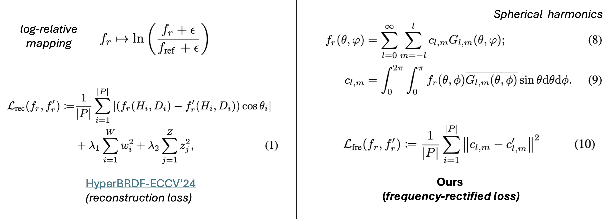

[](https:/peterhuistyping.github.io/FreNBRDF/) [](https://arxiv.org/abs/2507.00476)  [](https://cdfg.csail.mit.edu/wojciech/brdfdatabase)

<!-- [] -->

<!-- (https://www.python.org/) -->

<!-- [](https://huggingface.co/Peter2023HuggingFace/NeuMaDiff)   -->

# FreNBRDF: A Frequency-Rectified Neural Material Representation

<p align="center"><a href="https://chenliang-zhou.github.io">Chenliang Zhou</a>†, <a href="https://peterhuistyping.github.io/">Zheyuan Hu</a>†, <a href="https://www.cl.cam.ac.uk/~aco41/">Cengiz Öztireli</a></p>

<p align="center">Department of Computer Science and Technology<br>University of Cambridge</p>

<p align="center"><small>† denotes equal contribution.</small></p>

<p align="center">
    <a href="https:/peterhuistyping.github.io/FreNBRDF/">[Project page]</a>  
    <a href="https://arxiv.org/abs/2507.00476">[Paper]</a>
    <!-- <a href="https://huggingface.co/Peter2023HuggingFace/NeuMaDiff">[Base model weights]</a> -->
    <a href="https://cdfg.csail.mit.edu/wojciech/brdfdatabase">[MERL dataset]</a>
</p>


Overview of our FreNBRDF architecture.

# Abstract

Accurate material modeling is crucial for achieving photorealistic rendering, bridging the gap between computer-generated imagery and real-world photographs. While traditional approaches rely on tabulated BRDF data, recent work has shifted towards implicit neural representations, which offer compact and flexible frameworks for a range of tasks. However, their behavior in the frequency domain remains poorly understood.

To address this, we introduce *FreNBRDF*, a frequency-rectified neural material representation. By leveraging spherical harmonics, we integrate frequency-domain considerations into neural BRDF modeling. We propose a novel *frequency-rectified loss*, derived from a frequency analysis of neural materials, and incorporate it into a generalizable and adaptive reconstruction and editing pipeline. This framework enhances fidelity, adaptability, and efficiency.

Extensive experiments demonstrate that FreNBRDF improves the accuracy and robustness of material appearance reconstruction and editing compared to state-of-the-art baselines, enabling more structured and interpretable downstream tasks and applications.

# Main methodology

For the network, we adopt a set encoder [21] with permutation invariance and flexibility of input size. It takes an arbitrary set of samples as input, which is the concatenation of BRDF values and coordinates, containing four fully connected layers with two hidden layers of 128 hidden neurons and ReLU activation function. 
            
The **reconstruction loss** between two NBRDFs is defined to be the sum of the L1 loss between samples of the two underlying BRDFs and the two regularization terms for NBRDF weights w and latent embeddings z.

 

A summary of the main methodology, i.e. how Frequency-Rectified Neural BRDFs are constructed and optimized based on prior work.
            
**Frequency Recitification** The key insight here is that these frequency coefficients now contain the extracted frequency information at each degree l and order m. Therefore, we can define a frequency-rectified loss on BRDFs based on the mean squared error of frequency coefficients and consequently, we can incorporate this loss into the reconstruction loss Eq. (1).

           
# BRDF datasets and codebases references
            
Inspired by prior work [FrePolad (ECCV'24)](https://github.com/Chenliang-Zhou/FrePolad), [HyperBRDF (ECCV'24)](https://github.com/faziletgokbudak/HyperBRDF) and [NeuMaDiff](https://arxiv.org/abs/2411.12015), we adopt MERL (2003) from [here](https://cdfg.csail.mit.edu/wojciech/brdfdatabase/), which contains reflectance functions of 100 different materials, as our main dataset. This dataset is ideal due to its diversity and data-driven nature, making it suitable for both statistical and neural-network-based methods. 

It contains 100 measured real-world materials. Each BRDF is represented as a 90 × 90 × 180 × 3 floating-point array, mapping uniformly sampled input angles (θ_H , θ_D , ϕ_D) under Rusinkiewicz reparametrization to reflectance values in R^3.
   
# Evaluation and visualization

For more details, please refer to our [paper](https://arxiv.org/abs/2507.00476) or [project page](https://peterhuistyping.github.io/FreNBRDF/). Thanks~

# Citation

Please feel free to contact us if you have any questions or suggestions.

If you found the paper or code useful, please consider citing,

```
@misc{zhou2025FreNBRDF,
      title={FreNBRDF: A Frequency-Rectified Neural Material Representation}, 
      author={Chenliang Zhou and Zheyuan Hu and Cengiz Oztireli},
      year={2025},
      eprint={2507.00476},
      archivePrefix={arXiv},
      primaryClass={cs.GR},
      url={https://arxiv.org/abs/2507.00476}, 
}
```
